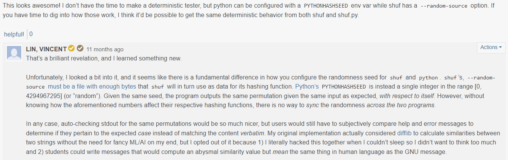
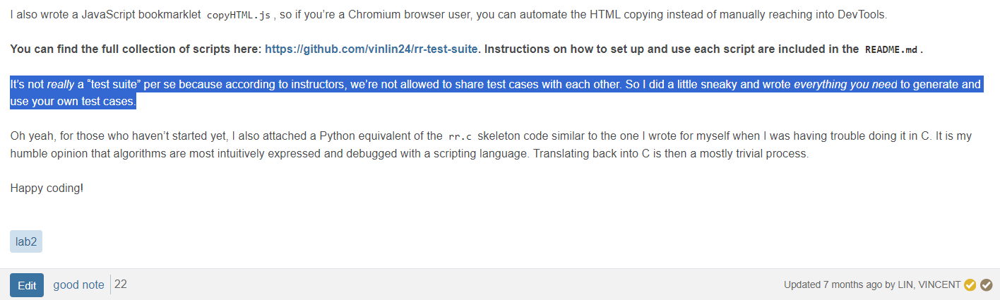
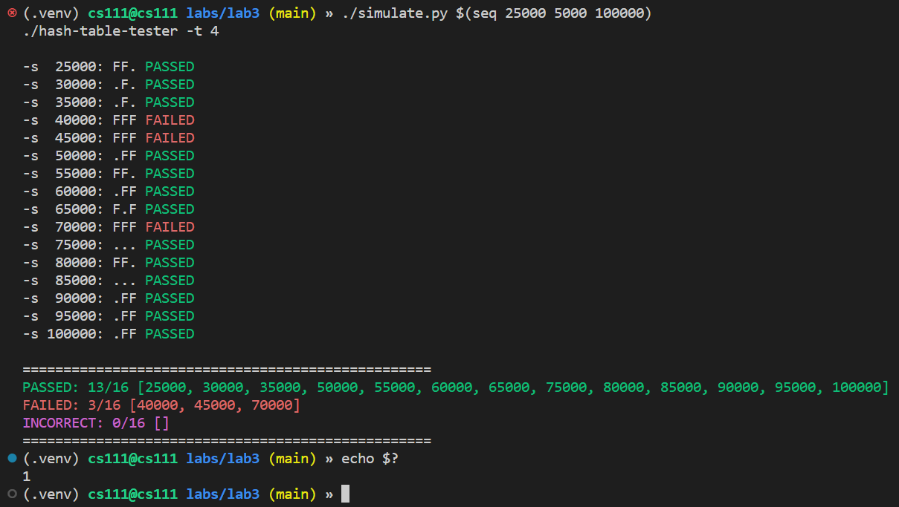
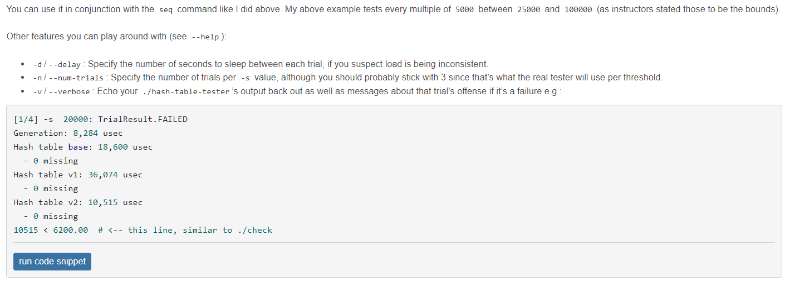
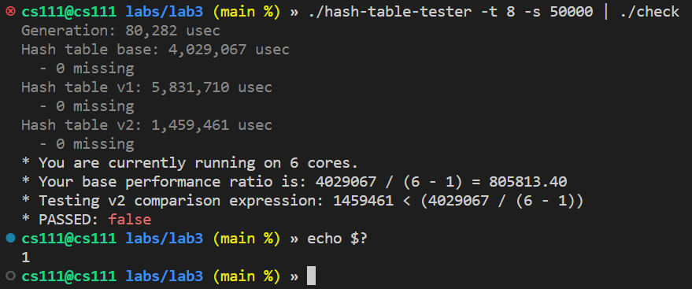
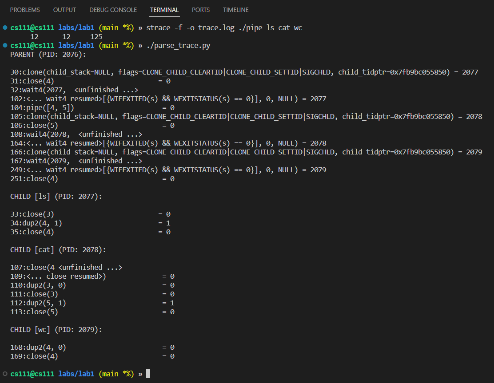
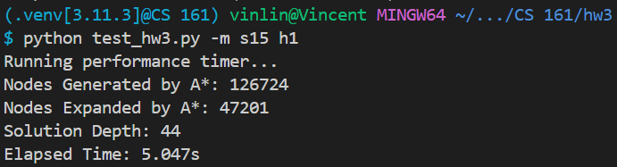
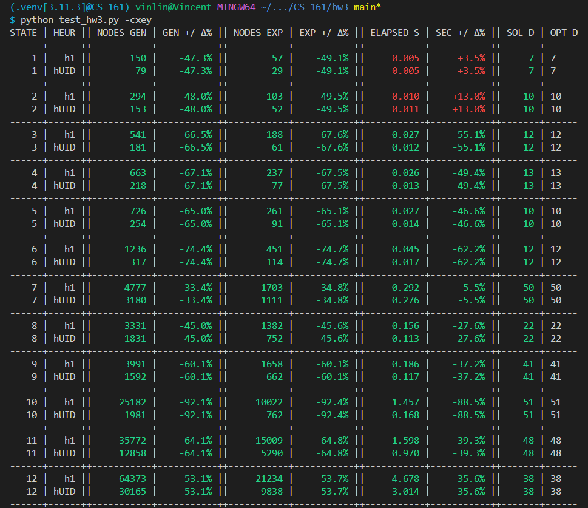
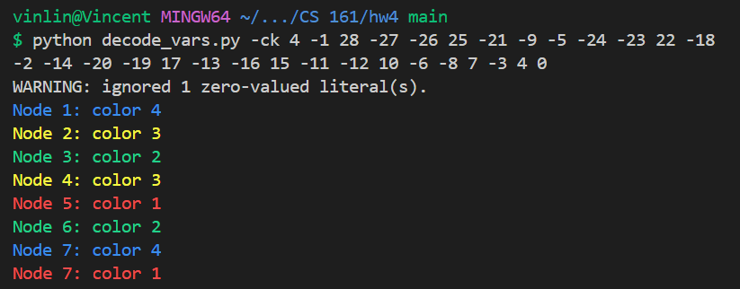

# Contributions to UCLA CS Lab Assignments

This is a list of contributions I made on my own initiative to make testing and
debugging lab assignments easier for myself and hundreds of classmates. Every
header is a link to the dedicated repository/Gist, so this document serves as a
"linktree" of sorts.

> [!WARNING]
>
> Some have been endorsed on Piazza, but these creations were never officially
> assigned by instructors nor were they meant to be a substitute for the real
> grading mechanisms.


## [test-shuf](https://github.com/vinlin24/test-shuf)

Class: **COM SCI 35L: Software Construction** (Fall 2022)

An interactive TUI for testing our implementation for our **Python scripting
lab**, where we were tasked with implementing the [GNU
`shuf`](https://man7.org/linux/man-pages/man1/shuf.1.html) command but with
Python and its [argparse](https://docs.python.org/3/library/argparse.html)
library.

This tester was motivated by the fact that the output of `shuf` is (obviously)
random, so we could not use the straightforward approach of comparing the output
of our `shuf.py` to the real `shuf` line by line. Pseudorandomness means that
the output is technically deterministic if given the same seeds, but to my
knowledge, there is no way to "use the same seed" across both programs as I
explain in this exchange on our class Piazza:



[The repository
README](https://github.com/vinlin24/test-shuf#shufpy-interactive-tester) is
outfitted with details setup instructions as well as demo images.


## [rr-test-suite](https://github.com/vinlin24/rr-test-suite)

Class: **COM SCI 111: Operating System Principles** (Winter 2023)

A collection of useful scripts for students' development and testing workflow
for our **Process scheduling lab**, where we were tasked with implementing a
Round Robin scheduler.

The suite includes a Python version of the C starter code as well as scripts
designed to work with an [online process scheduling
solver](https://boonsuen.com/process-scheduling-solver). The latter would be
used to parse the HTML of the online solver output given the input parameters,
thereby giving us a way to know the answer to our own test cases. This wasn't
cheating, as I cheekily describe in my Piazza post:



As usual, setup and usage information is available on the [repository
README](https://github.com/vinlin24/rr-test-suite#round-robin-lab-test-suite).


## [ext2-test-suite](https://github.com/vinlin24/ext2-test-suite)

Class: **COM SCI 111: Operating System Principles** (Winter 2023)

A collection of useful scripts for students' development and testing workflow
for our **filesystem lab**, where we were tasked with implementing a script to
generate a valid ext2 filesystem image.

In this suite, I extended the Python unittest provided in the handout with more
useful and comprehensive tests. I also provided some scripts to better sanity
check students' progress as they practice incremental development, such as one
that compares `dumpe2fs` output to the expected output provided by a TA.

As usual, setup and usage information as well as demo output is available on the
[repository
README](https://github.com/vinlin24/ext2-test-suite#lab-4-ext2-test-suite).


## [Hash Table Tester Simulator](https://gist.github.com/vinlin24/ed40765c704e778d96a87dea67654277)

Class: **COM SCI 111: Operating System Principles** (Winter 2023)

A Python script that simulates correctness and performance-checking of our
implementation for our **threading lab**, where we were tasked with implementing
a thread-safe hash table using mutex locks.

Basically, our TA had posted that for each test case of load (number of entries
to insert into the hash table), we'll be tested 3 times:

* If there's a correctness error (missing entry), that case is an immediate
  fail.
* Otherwise if *any* trial passes some performance threshold (defined by the TA
  on Piazza), that case counts as a pass.

This lab was frustrating for all of us due to inconsistent and non-deterministic
performance when running on either our VM and school server, which motivated me
to write a script to run many trials in batch to "simulate" the test cases with
incrementing values of hash table entries and output a summary all at once.
Example output:



I also gave the script some command-line arguments. Usage instructions as shared
in my Piazza post:



This script was itself an upgrade of a [shell
script](https://gist.github.com/vinlin24/7642feaf3fe570b32f51b93b6dcaf5c0) I
shared before this to just check for performance of a single run:




## [strace Output Filter](https://gist.github.com/vinlin24/5104f224f8b58178eb72a81bc14e667a)

Class: **COM SCI 111: Operating System Principles** (Winter 2023)

A Python script that filters the output of `strace` for lines relevant to our
implementation of our **pipe lab**, where we were tasked with implementing the
pipe operator in shell commands. Many students were struggling with determining
if their implementation met the requirement of "properly closing all file
descriptors", so I made this script to wrap `strace`, which was the canonical
way to debug our program behavior.

Example usage and output as shared on Piazza:




## [Unit Tester for Search Problem Implementation](https://gist.github.com/vinlin24/e2fa0f53d65310db697a7a1b98b6beb1)

Class: **COM SCI 161: Fundamentals of Artificial Intelligence** (Spring 2024)

A unit tester and debugging tool for the assignment where we were to solve [The
Simpsons' version of the river crossing
problem](https://simpsons.fandom.com/wiki/Gone_Maggie_Gone).

This script implemented some
[`unittest.TestCase`](https://docs.python.org/3/library/unittest.html#unittest.TestCase)
suites to test each question as well as provided some utilities to help debug
the top-level solver. For example, there is an option to run the student's
solver and decode their returned state path to draw out and explain each
transition:

<details>
<summary>🔽 Expand to see example output 🔽</summary>

```console
$ python3 test_hw2.py -e | less
--------------------------------------------------
Index:     PATH[0] ===> PATH[1]
State:   (F,F,F,F) ===> (T,T,F,F)

(F,F,F,F):          || H,B,D,P
(T,T,F,F):      H,B || D,P

>> Homer, Baby moved to the WEST (LEFT).
--------------------------------------------------
Index:     PATH[1] ===> PATH[2]
State:   (T,T,F,F) ===> (F,T,F,F)

(T,T,F,F):      H,B || D,P
(F,T,F,F):        B || H,D,P

>> Only Homer moved, to the EAST (RIGHT).
--------------------------------------------------
Index:     PATH[2] ===> PATH[3]
State:   (F,T,F,F) ===> (T,T,T,F)

(F,T,F,F):        B || H,D,P
(T,T,T,F):    H,B,D || P

>> Homer, Dog moved to the WEST (LEFT).
--------------------------------------------------
Index:     PATH[3] ===> PATH[4]
State:   (T,T,T,F) ===> (F,F,T,F)

(T,T,T,F):    H,B,D || P
(F,F,T,F):        D || H,B,P

>> Homer, Baby moved to the EAST (RIGHT).
--------------------------------------------------
Index:     PATH[4] ===> PATH[5]
State:   (F,F,T,F) ===> (T,F,T,T)

(F,F,T,F):        D || H,B,P
(T,F,T,T):    H,D,P || B

>> Homer, Poison moved to the WEST (LEFT).
--------------------------------------------------
Index:     PATH[5] ===> PATH[6]
State:   (T,F,T,T) ===> (F,F,T,T)

(T,F,T,T):    H,D,P || B
(F,F,T,T):      D,P || H,B

>> Only Homer moved, to the EAST (RIGHT).
--------------------------------------------------
Index:     PATH[6] ===> PATH[7]
State:   (F,F,T,T) ===> (T,T,T,T)

(F,F,T,T):      D,P || H,B
(T,T,T,T):  H,B,D,P ||

>> Homer, Baby moved to the WEST (LEFT).
```
</details>

The script is equipped with a CLI to offer control over testing specific
questions and the different debugging utilities.


## [Unit Tester for Sokoban Solver](https://gist.github.com/vinlin24/5379704763a06952d91c0af0f52ddbb3)

Class: **COM SCI 161: Fundamentals of Artificial Intelligence** (Spring 2024)

Unit tester and debugging tool for the assignment where we were to implement
solving [Sokoban](https://en.wikipedia.org/wiki/Sokoban) and coming up with a
custom heuristic function to speed up the A* search.

In addition to writing unit tests for each question and exposing them with a CLI
[like above](#unit-tester-for-search-problem-implementation), I also added
options for streamlining students' development experience as they tried to
improve their custom heuristic functions:






## [RSat Variable Assignment Decoder](https://gist.github.com/vinlin24/06959dabb001a28dd4916856d8bab9a9)

Class: **COM SCI 161: Fundamentals of Artificial Intelligence** (Spring 2024)

Helper script for the assignment where we were to convert a graph coloring
problem to a SAT problem to pass to a [SAT
solver](http://reasoning.cs.ucla.edu/rsat/).

The RSat solver accepts a specific file format consisting of numbers encoding
Boolean literals. When solutions are found, it outputs variable assignments with
this same encoding:

```console
$ ./rsat_2.01_win.exe cnfs/something.cnf  -s
c Rsat version 2.01
v -1 -28 -27 -26 25 -21 -9 -5 -24 -23 22 -18 -2 -14 -20 -19 17 -13 -16 15 -11 -12 10 -6 -8 7 -3 4 0
c
c
s SATISFIABLE
c CNF stats: (28 vars, 97 clauses)
c Decisions: 11
c Conflicts: 0
c Running time: 0.00200 seconds
```

The variable assignments can then be passed to my script to decode and interpret
them in the context of the graph coloring problem, with support for actual
colored output:



## [Averaging Performance Output](https://gist.github.com/vinlin24/1dbc11cec4c97816cf916b1c8f32bdb2)

Class: **COM SCI 133: Parallel and Distributed Computing** (Spring 2025)

Helper script for averaging the performance output of the provided testbed for our [GEMM](https://en.wikipedia.org/wiki/GEMM) implementations. This was useful for report-writing or just as a sanity check since performance calculations were non-deterministic.

Basic usage:

```sh
python3 gemm_stats.py --help
python3 gemm_stats.py 5
python3 gemm_stats.py 3 -i parallel
```
